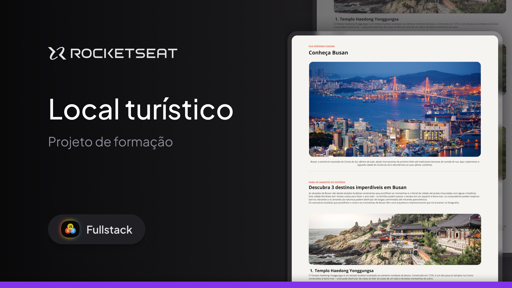

# Local Turístico | Tourist Site | Lugar Turístico
*Web site showing tourist sites.*  
*Site Web que apresenta locais turísticos.*  
*Página Web de presentación de lugares turísticos.*

 

  

---

## 🗂️ Table of Contents | Índice | Indice
1. [About the Project | Sobre o Projeto | Sobre el Proyecto](#about-the-project--sobre-o-projeto--sobre-el-proyecto)
2. [Key Features | Caraterísticas Principais | Características Principales](#key-features--características-principais--características-principales)
3. [Technologies | Tecnologias | Tecnologías](#technologies--tecnologias--tecnologías)
4. [Layout | Estrutura | Estructura ](#layout--estrutura--estructura)
7. [License | Licença | Licencia](#license--licença--licencia)
8. [Authors and Acknowledgments | Autores e Agradecimentos | Autores y Agradecimientos](#authors-and-acknowledgments--autores-e-agradecimentos--autores-y-agradecimientos)

---

## 📃 About the Project | Sobre o Projeto | Sobre el Proyecto

*Tourist Site** it's a website that brings together travel locations for tourists to spend their holidays and have a relaxing time with their families and friends.
The site consists of photos of the location and short, concise texts about the city or region to be shown to the user.   
*Local Turístico** é um Website que reúne locais de viagem para os turistas passarem as suas férias e terem um momento de descontração para com as suas famílias e amigos.
O site é composto por fotografias do local, textos curtos e concisos sobre a cidade ou região a mostrar ao usuário.   
*Lugar Turístico** es un sitio web que reúne lugares para que los turistas pasen sus vacaciones y tengan un momento de tranquilidad con sus familias y amigos.
El sitio consta de fotografías del lugar, textos breves y concisos sobre la ciudad o región que se muestran al usuario.

### 📌 Why did we create Tourist Site? | Por que criamos o Local Turístico | ¿Por qué creamos el Lugar Turístico?
- To provide moments of pleasure.  
Para proporcionar momentos de prazer.   
Proporcionar momentos de satisfacción.   
- Showing people the beautiful places that exist.  
Para mostrar às pessoas os lugares bonitos que existem.  
Para mostrar a las personas los bellos lugares que existen.   
- To connect people to themselves.  
Para conectar as pessoas a si próprias.  
Conectar a las personas consigo mismas.   
- To slow people down in this chaotic world.  
Para desacelerar as pessoas neste mundo caótico.  
Para desacelerar a las personas en este mundo caótico.

---

## 🚀 Key Features | Características Principais | Características principales

- It shows the user their possible new trip based on their lifestyle.   
Mostra ao usuário sua possível nova viagem com base no seu estilo de vida.   
Muestra al usuario su posible nuevo viaje en función de su estilo de vida.  
- If that's not enough, the artificial intelligence suggests some alternatives based on the number of searches for a particular location.   
Se isso não for suficiente, a inteligência artificial sugere algumas alternativas com base no número de pesquisas para uma determinada localização.   
Por si fuera poco, la inteligencia artificial sugiere algunas alternativas en función del número de búsquedas de un lugar determinado.

---

## 🚀 Technologies | Tecnologias | Tecnologías

This project (website) was developed using the following technologies:  
Este projeto (website) foi desenvolvido com as seguintes tecnologias:  
Este proyecto (website) se ha desarrollado utilizando las siguientes tecnologías:
> **HTML & CSS**  
> **Git & GitHub**  
> **Figma**  

Access the completed project by clicking on the link below:  
Acesse o projeto finalizado online clicando no link abaixo:  
Consulte el proyecto finalizado en línea haciendo clic en el link a bajo:

[clique aqui...](https://lfrclnando.github.io/tourist-site/)

---

## 🔖 Layout | Estrutura | Estructura

You can view the layout of the original project by clicking below... 
Você pode visualizar a estrutura do projeto original clicando abaixo... 
Puede ver la estructura del proyecto original haciendo clic a bajo...  
[NESSE LINK](https://www.figma.com/design/fUbew7ii50imbSJ18jg7rR/Local-Tur%C3%ADstico-(Community)?node-id=0-1&p=f&t=5UIUk0BucH3JkHmz-0).   
You must have an account with [Figma](https://figma.com) to access it.  
É necessário ter conta no [Figma](https://figma.com) para acessá-la.  
Debe tener una cuenta en [Figma](https://figma.com) para entrar a ella.

---

# 📝 License | Licença | Licencia

This project is licensed under the MIT License. See the [LICENSE](LICENSE) file for more details.  
Este projeto está licenciado sob a licença MIT. Veja o arquivo [LICENSE](LICENSE) para mais detalhes.  
Este proyecto está licenciado bajo la licencia MIT. Ver el archivo [LICENSE](LICENSE) para más detalles. 

---

## 💻 Authors and Acknowledgments | Autores e Agradecimentos | Autores y Agradecimientos

<h3 align="right">Feito com dedicação 🦅 Fernando</h3>